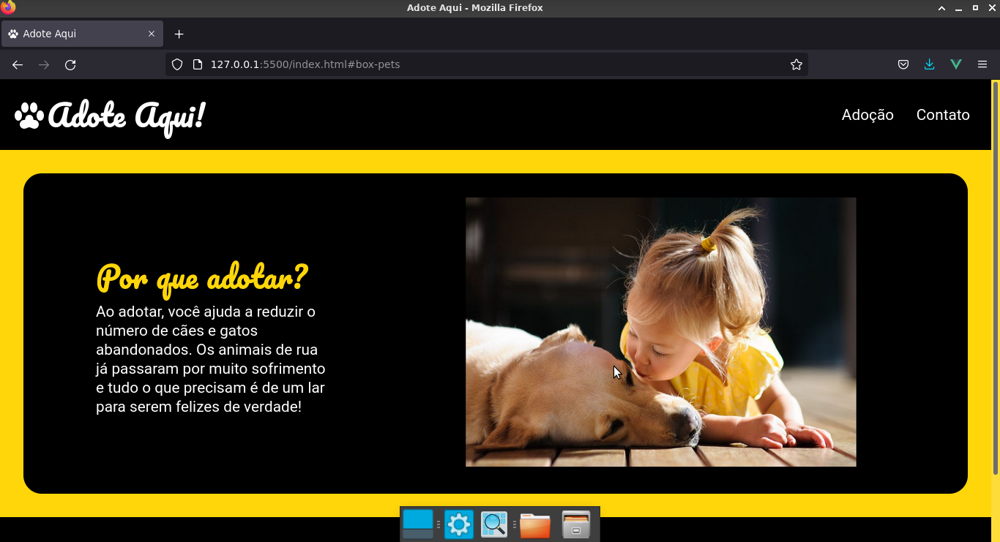
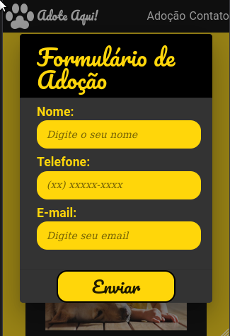

# Adote Aqui (v2.0)🐶 

Este projeto trata-se de um reboot de um antigo código meu que era bem mais simples, porém com um valor emocional. Neste projeto foi utilizado o Vue.js, diferente do anterior que usava um HTML e CSS simples e sem responsividade.

## Confira o projeto on-line:😉

```
```

## Caso você queira analisar o projeto em sua maquina, siga esses passo a passo: 😁

<br>

### Clone o repositório😎

```
git clone 
```


## Imagens do projeto 💻



<br>



## Tecnologias utilizadas🦉

<ul>
    <li>VueJS</li>
    <li>JavaScript</li>
    <li>HTML</li>
    <li>CSS</li>
</ul>

## Autor😃

### João Victor dos Santos Moura
### E-mail: joaovictors.mouraa@gmail.com
### Linkedin: https://www.linkedin.com/in/jovimoura10/